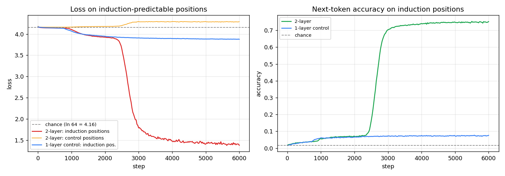
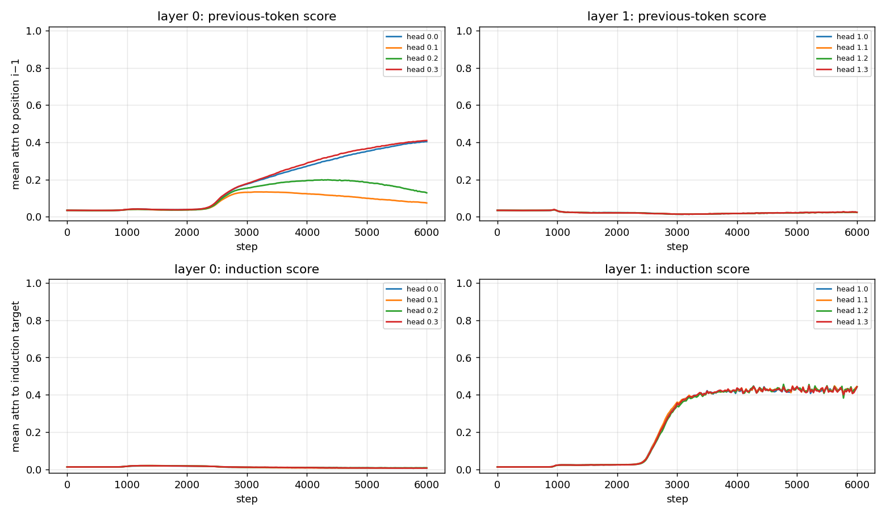
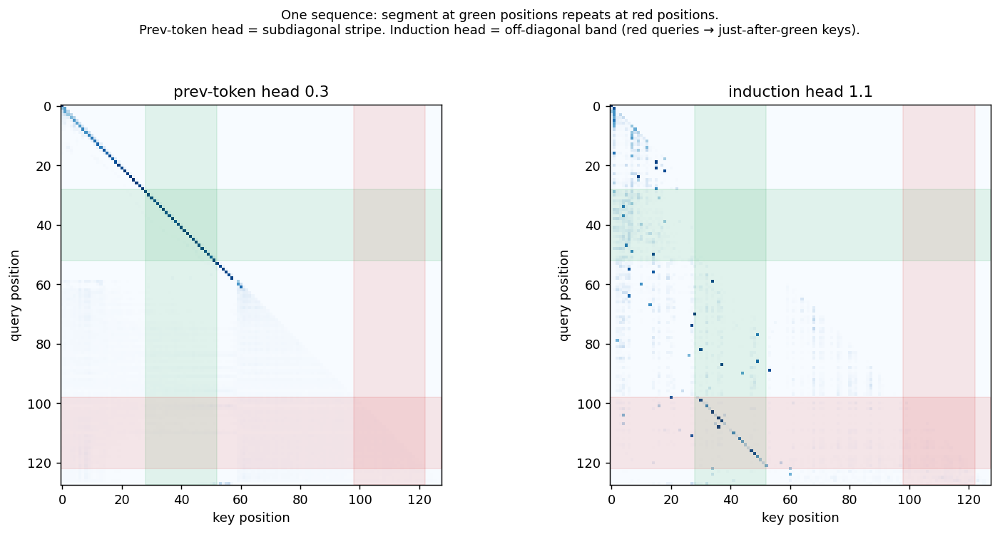
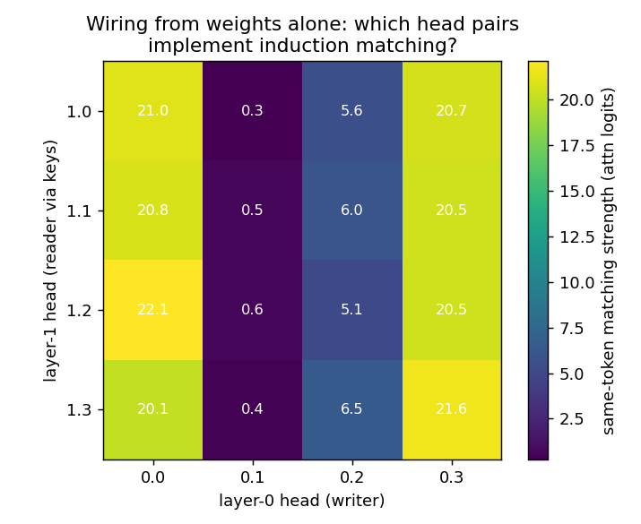
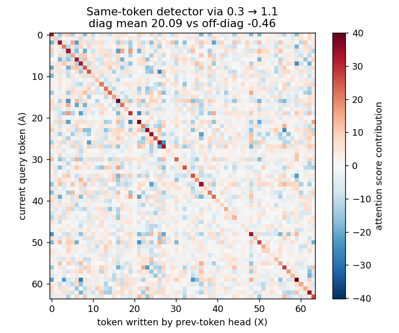
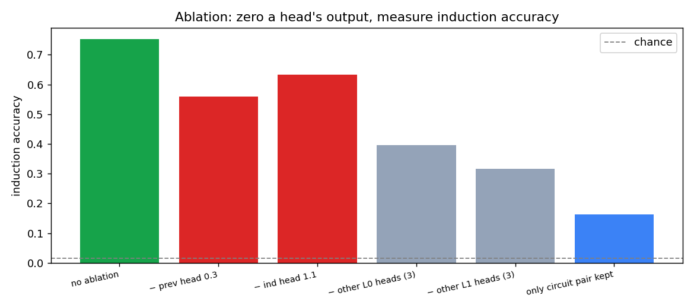

# Induction heads, from scratch

Train a tiny two-layer transformer to continue sequences of pure random
tokens and something remarkable happens: for ~2,400 steps it improves only
marginally — then, in a window of a few hundred steps, an algorithm snaps
into place and accuracy jumps from 9% to 75%. The algorithm is the
**induction head**: *"find where the current token appeared before, copy
what came next."* It is the leading candidate mechanism for in-context
learning, and its abrupt formation — a **phase change** — was documented
by Anthropic in
[Olsson et al. 2022](https://transformer-circuits.pub/2022/in-context-learning-and-induction-heads/index.html).

This repo reproduces the phenomenon end-to-end on a laptop (~9 minutes for
both runs), then opens the network and verifies the circuit five different
ways — including reading it directly out of the weight matrices and
knocking it out causally.

The transformer is written from scratch in raw PyTorch tensors — no
`nn.Module`, no `nn.Linear`, no `nn.Embedding` — in
[`induction_from_scratch.py`](induction_from_scratch.py). Companion repo:
[grokking-from-scratch](https://github.com/carloslfu/grokking-from-scratch)
(same philosophy, different phenomenon).

## What is an induction head?

The pattern-completion rule `[A][B] … [A] → predict [B]`. If "Kowalczyk"
appeared 500 tokens ago, the model can continue "Kow" with "alczyk" even if
it never saw that name in training — the knowledge is in the *context*, not
the weights. This is a big part of why LLMs can reuse your variable names,
keep spelling consistent, and learn from few-shot examples — Olsson et al.
present "preliminary and indirect evidence" that induction heads drive the
majority of all in-context learning. Induction heads are the minimal
circuit implementing the pattern.

## How the circuit works — the answer up front

One attention head can't do it. Attention is a lookup that can only match
on what's already stored at each position, and "which token *preceded*
position j" isn't stored anywhere at the start. So the circuit takes two
heads in two layers, composing through the residual stream:

```
sequence:      ...  [A]      [B]      ...      [A]   ← what comes next?
                    pos 10   pos 11           pos 50

LAYER 0 — previous-token head:
    at pos 11, attend to pos 10, write "before me: A"
    into pos 11's residual stream
                     │
                     ▼   (the note flows down the residual stream)
LAYER 1 — induction head:
    at pos 50 ("I am A"), search keys for "before me: A"
    → match at pos 11 → copy its token: predict B
```

The offset-by-one trick: the induction head lands on **B** (not the old A)
because the *note about A* is attached to B's position. Matching the note
naturally lands you one step ahead of the previous occurrence.

In weights: the induction head's **keys** are computed from what the
previous-token head **wrote** (K-composition). The chain
`E · W_QK^{ind} · (W_OV^{prev})ᵀ · Eᵀ` should behave like a same-token
detector — big exactly on the diagonal. (It does; see below.)

## The task — and why it's designed this way

Sequences of 128 uniform-random tokens (vocab 64), where a 24-token segment
is copied to a **random later position**:

```
tokens:   [ ...random... | SEGMENT | ...random... | SEGMENT | ...random... ]
                           ↑ p1 (random)            ↑ p2 (random)
```

- Positions inside the second copy are predictable **only via induction**:
  the current token's earlier occurrence tells you what comes next.
- Every other position is irreducible noise (loss = ln 64 ≈ 4.16). All
  learnable signal funnels through the induction algorithm.
- **Random offsets are load-bearing.** If the repeat were at a fixed offset
  (say, second half = first half), a 1-layer model could cheat with a fixed
  positional-shift head — no content matching, no induction. Random offsets
  force the real algorithm.
- **Data is generated fresh every step.** Memorization is impossible by
  construction; anything the model learns must be an algorithm.

## The model

2-layer, attention-only (no MLPs — the setting where the circuit is
provable), 4 heads per layer, d_model 128, learned positional embeddings,
no LayerNorm, no biases: **163,840 parameters**. Also a 1-layer twin
(`--layers 1`) as the control.

## What happens during training

| Milestone (2-layer) | Step |
|---|---|
| Slow crawl: chance (1.6%) → 9% | 0 – 2,400 |
| Accuracy > 10% | 2,450 |
| Accuracy > 50% | **2,725** |
| Accuracy > 70% | 2,975 |
| Levels off at ~72%, drifting to 0.752 | ~3,200 → 6,000 |



A real phase change: 2,400 steps of slow crawl, then accuracy goes from
10% to 50% in **275 steps**. The control makes it sharper: the **1-layer
model (blue) crawls identically — the two curves are indistinguishable
until step ~2,400 — and then only the 2-layer one jumps.** After 6,000
steps the control sits at 7.6%, no induction head, exactly as the theory
demands: composition needs two layers.

(Two honest details: the pre-jump crawl from 1.6% to ~9% is
skip-trigram-ish statistics — the 1-layer control learns the same tricks,
so that is the ceiling for any non-compositional strategy here. And
control-position loss ends slightly *above* chance: the model pays a small
confidence tax on unpredictable positions.)

**Robustness**: a seed-1 replication (`--seed 1`, log committed as
`training_log_L2s1.json`) shows the same story with shifted timing — phase
change at steps 1,950 → 2,300 (350-step window), final accuracy 0.759, all
four layer-1 heads again becoming induction heads in lockstep. Which
layer-0 heads become the writers varies by seed (seed 0: two co-equal;
seed 1: one dominant, two partial) — the roles are stable, the cast is a
lottery. Every quantitative claim in this README is checked by
[`verify.py`](verify.py) (55 automated checks against the raw artifacts —
this run: Apple-silicon MPS, seed 0; on other backends the init draw
differs, so head assignments and exact steps will shift while the
structural story holds).

## Watching the circuit assemble

Per-head scores over training — previous-token score (attention to
position i−1) and induction score (attention to the ground-truth induction
target):



Read the four panels together and the story is precise:

- **Roles are layer-bound**: layer-0 heads develop previous-token behavior,
  layer-1 heads develop induction behavior, never the reverse. (The reverse
  is impossible: the note must be written before it can be read.)
- **Both parts form simultaneously at the phase change** (~step 2,400–3,000)
  — the writer and reader co-evolve; neither is useful alone.
- **The circuit is a team, not a pair**: heads 0.0 *and* 0.3 both become
  previous-token heads (score 0.41 each), and **all four** layer-1 heads
  become induction heads in lockstep (0.44 each). Redundancy emerges even
  in a 4-head toy model — the same property that makes ablations messy in
  13-billion-parameter models appears here in miniature.

## The attention patterns

One example sequence (green = first copy of the segment, red = second):



- **Prev-token head 0.3**: a crisp sub-diagonal stripe — every position
  attends to its predecessor. Note the stripe *fades after position ~64*:
  the true source segment always lies early (p1 ≤ 40), so positions beyond
  ~64 can never be induction targets, and the model simply doesn't bother
  annotating them. Gradient economy, visible to the naked eye.
- **Induction head 1.1**: from the red queries (second copy), a sharp
  diagonal band inside the green key columns, offset by one — attending
  exactly to "just after the previous occurrence."

## The circuit, read from the weights alone

For each (layer-0 head, layer-1 head) pair, build the token-level matrix
`E · W_QK^{h1} · (W_OV^{h0})ᵀ · Eᵀ` and measure how diagonal it is — i.e.,
does this pair implement "attend where the written previous-token equals my
current token"?



The matrix identifies the team exactly: the two behavioral prev-token heads
(0.0, 0.3) write a channel that **all four** layer-1 heads read (~21
attention logits of same-token matching); head 0.1 contributes nothing
(≤ 0.6); head 0.2 is weak (~6). And the full 64×64 detector for the
strongest pair:



A blazing diagonal: **+20.1** on the diagonal vs **−0.46** off it. The
induction mechanism, written in the weights, extracted with three matrix
multiplications. No forward pass required.

## The causal test: ablations

Zero out heads' outputs and measure induction accuracy:



| Ablation | Accuracy |
|---|---|
| None | 0.752 |
| − best prev-token head (0.3) | 0.560 |
| − best induction head (1.1) | 0.633 |
| − the other 3 layer-0 heads | 0.395 |
| − the other 3 layer-1 heads | 0.316 |
| **Only the best pair kept** (6 heads zeroed) | 0.163 |

Every piece of the circuit is causally necessary in proportion to its
size, and the single best pair alone still does induction at 10× chance —
but far below the full model. The circuit is genuinely distributed. This is
the honest, real-world version of the story: even here, "the induction
head" is really "the induction head *team*."

## How good is the learned algorithm?

Ceilings computed on the same data:

| Strategy | Accuracy |
|---|---|
| Chance | 0.016 |
| Best possible **single-token** matcher | 0.641 |
| The trained model | **0.752** |
| Best possible **bigram** matcher | 0.982 |

The model *beats* the optimal single-token matcher by ~11 points — so it's
doing more than textbook induction — yet it's far from the bigram ceiling.
We checked the obvious mechanisms and ruled them out: no layer-0 head
attends to position i−2 (no bigram annotation), a position-prior tie-break
doesn't raise the matcher's ceiling, and the model's accuracy is nearly
flat in depth-into-segment (0.72 at j=0, where no left-context exists). How
the model earns those extra points is an **open question in this repo** —
a genuinely unexplained residue of the kind real interpretability work
always leaves. If you figure it out, open an issue.

## Takeaways

- **Sudden jumps in capability can be circuit formation.** Nothing in the
  loss curve hints at what's coming until it comes. Watching per-head
  scores (cheap!) shows the transition as it happens — the measurement
  lesson from the [grokking repo](https://github.com/carloslfu/grokking-from-scratch),
  again.
- **Composition is the point of depth.** One layer can only match on raw
  token/position; two layers can match on *computed* properties. In-context
  learning is born exactly at that boundary — the 1-layer control makes it
  a theorem-shaped empirical fact.
- **Redundancy is not a big-model disease.** Even 164K params spread the
  algorithm across 6 of 8 heads. "The circuit" is a team wherever you look.

## Run it yourself

```bash
python3 induction_from_scratch.py              # 2-layer run, ~6 min (M3 Pro, MPS)
python3 induction_from_scratch.py --layers 1   # 1-layer control, ~3 min
python3 analyze.py                             # all plots + numeric report
python3 verify.py                              # re-checks every number in this README
```

Requirements: Python 3, PyTorch (MPS, CUDA, or CPU), matplotlib.

## Configuration

| | |
|---|---|
| Model | 2-layer attention-only transformer, d_model 128, 4 heads (d_head 32) |
| | learned positional embeddings, no LayerNorm, no biases — 163,840 params |
| Data | vocab 64, seq len 128, segment len 24, random offsets, fresh every step |
| Optimizer | AdamW, lr 1e-3, weight decay 0.01, betas (0.9, 0.98), batch 256, 6k steps |
| Checkpoints | 16 log-spaced snapshots per run → `checkpoints/` |

Committed: the training logs (`training_log_*.json`), so every
learning-curve and head-score claim is checkable without retraining. Not
tracked: `checkpoints/`, `params_*.pt`, `*.log` — all regenerated by
training.

## Going further

- **Solve the open question**: where do the extra 11 points over the
  single-token matcher come from? `analyze.py` has all the tooling
  (attention caches, per-position accuracy) to chase it.
- **Smeared keys**: Olsson et al.'s architecture tweak — blend each key
  with the previous position's key — lets even a *one-layer* model form
  induction heads. Add it and watch the control stop being a control.
- **Real text**: swap `make_batch` for a character-level corpus and watch
  the same heads emerge (slower, messier — the realistic version).
- **Q-composition variant**: implement the pointer-arithmetic induction
  head (duplicate-token head + positional offset) and compare.

## References

- Olsson et al. (2022).
  [In-context Learning and Induction Heads](https://transformer-circuits.pub/2022/in-context-learning-and-induction-heads/index.html).
- Elhage et al. (2021).
  [A Mathematical Framework for Transformer Circuits](https://transformer-circuits.pub/2021/framework/index.html).
- Power et al. (2022).
  [Grokking: Generalization Beyond Overfitting on Small Algorithmic Datasets](https://arxiv.org/abs/2201.02177)
  — the companion phenomenon, reproduced in
  [grokking-from-scratch](https://github.com/carloslfu/grokking-from-scratch).
